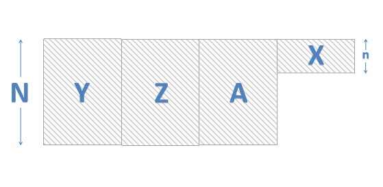
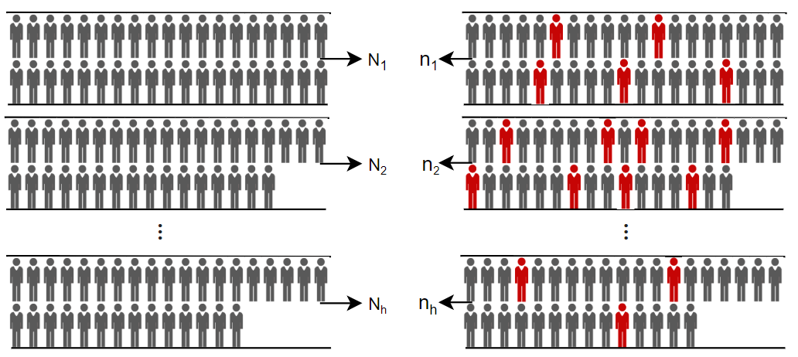
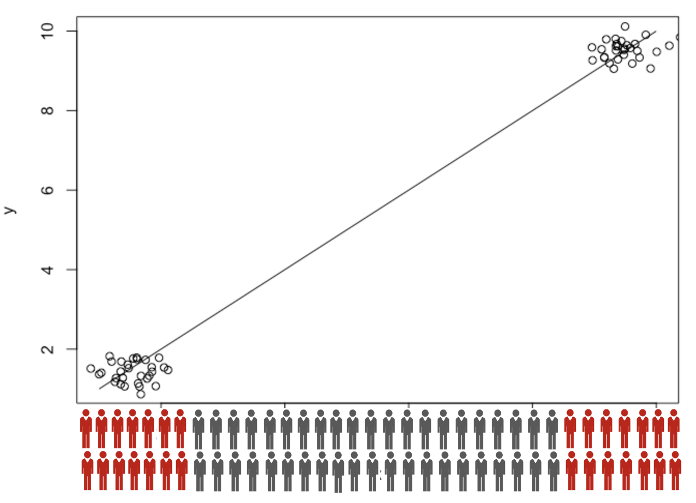
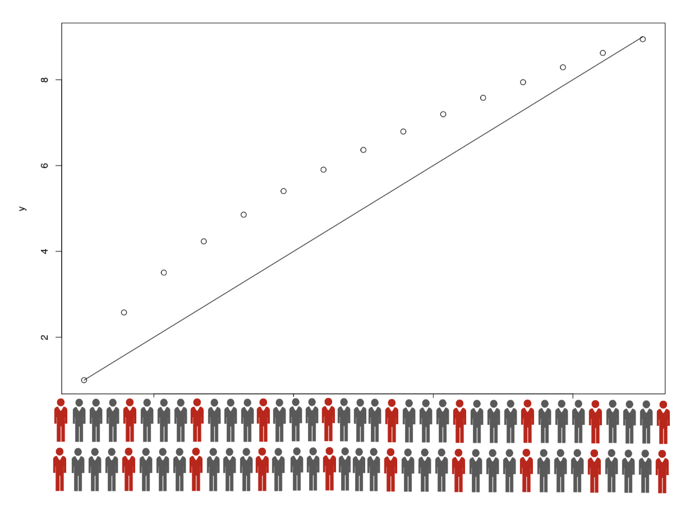

```{r setup, include=FALSE}
options(htmltools.dir.version = FALSE)
```

<style>

.remark-slide-number {
  position: inherit;
}

.remark-slide-number .progress-bar-container {
  position: absolute;
  bottom: 0;
  height: 6px;
  display: block;
  left: 0;
  right: 0;
}

.remark-slide-number .progress-bar {
  height: 100%;
  background-color: #EB811B;
}

.orange {
  color: #EB811B;
}

</style>

```{r, load_refs, include=FALSE, cache=FALSE}
library(RefManageR)
BibOptions(check.entries = FALSE,
           bib.style = "authoryear",
           cite.style = "latex",
           style = "markdown",
           hyperlink = FALSE,
           dashed = FALSE)
myBib <- ReadBib("bib1.bib")
```

# Motivation
<br>
<br>
<br>
* Measurement error problem 

    + Self-reporting error (smoking)
    
        - can be validated by biochemical review.
        
        - for cotinine – saliva or urine.
        
        - for carbon monoxide – blood.
---

# Two-phase design


<br>
- Phase I:  sample a large number of people from population.

  - Y: outcome of interest.
  
  - Z: expensive exposure variables or some cheap variables.
  
  - A: auxiliary variables (not in the model of interest).

<br>
- Phase II: sample a small number of individuals from the phase-I sample, and measure extra variables.

  - X: variables of interest which are expensive to measure.

---

# Data Structure
<br>
```{r, echo = FALSE, fig.align='center'}

```

$R_i = 1$ if subject $i$ is in the phase-II sample, otherwise, $R_i = 0$.

---

# Observed data likelihood
<br>
<br>
$$L = \prod_{R_i=1} f(\mathbf{y}_{i}|\mathbf{x}_{i},\mathbf{z}_{i};\beta) g(\mathbf{x}_{i}|\mathbf{z}_{i}, A; \alpha) \prod_{R_i=0} P(\mathbf{y}_{i}|\mathbf{z}_{i}, A;\beta,\alpha) ,$$

Where

- $f(\mathbf{y}_{i}|\mathbf{x}_{i},\mathbf{z}_{i};\beta)$ is the outcome model.

- $g(\mathbf{x}_{i}|\mathbf{z}_{i}, A; \alpha)$ is the imputation model.

- $P(Y|Z,A;\beta,\alpha) = \int f(Y|X,Z;\beta)g(X|Z,A; \alpha) dX$.

---


# Estimation methods

<br>

- Model based methods

 - Semi-parametric maximum likelihood estimator (MLE) (`r gsub("\\)", "", gsub(' \\(', ", ", Citet(myBib, c("scott1997fitting", "breslow1997maximum"))))`; `r gsub("\\)", "", gsub(' \\(', ", ", Citet(myBib, "tao2017efficient", .opts = list(max.names = 1,  longnamesfirst = FALSE))))`).
  
<br>


- Design-based methods (model-assisted survey sampling).
  
  - Weighted likelihood.
   
  - Generalized raking.
---

# Generalized raking

<br>
<br>
- Generalized raking:  adjusted π based on auxiliary variable $A$ `r Citep(myBib, "deville1992calibration")`.

$$\hat{T}_{\mathrm{Y}}=\sum_{i: R_{i}=1} \frac{g_{i}}{\pi_{i}} y_{i}$$


- Influence function serves as auxiliary information (`r gsub("\\)", "", gsub(' \\(', ", ", Citet(myBib, "breslow2009using", .opts = list(max.names = 1,  longnamesfirst = FALSE))))`; `r gsub("\\)", "", gsub(' \\(', ", ", Citet(myBib, "rivera2016using")))`).


---


# Optimal design

```{r echo=FALSE}

```

```{r echo=FALSE, out.width='20px', out.height ='40px'}

```
 : individuals sampled at phase II
 
```{r echo=FALSE, out.width='20px', out.height ='40px'}

```
 : individuals not in phase-II sample
 
---

# Optimal design - MLE

```{r, echo = FALSE,out.width = "650px", out.height="500px", fig.align='center'}

## the model is exactly true
```


---

# Optimal design - Design-based estimators

```{r, echo = FALSE,out.width = "650px", out.height="500px", fig.align='center'}

```

---

# Optimal design - Design-based estimators

<br>
Neyman allocation `r Citep(myBib, "neyman1934two", .opts = list(max.names = 1,  longnamesfirst = FALSE))`:

- minimize the variance of an estimator of population total.

- $\sqrt{n}(\hat{\beta} -\beta) = \sum_{i=1}^{h}\mathbf{h}_i(\beta) + O_p(n^{-1/2})$.

- The estimated optimal allocation for stratum $i$ is going to be 

$$\hat{n}_i = \frac{n N_i \text{Var}(\mathbf{h}_i(\beta))^{1/2}}{\sum_{i = 1}^h{N_i \text{Var}(\mathbf{h}_i(\beta))^{1/2}}}$$
$\space$ $\space$ where $\mathbf{h}_i(\beta)$ is the influence function for $\hat{\beta}$.

---
# Multi-wave sampling

<br>
- Optimal design depends on the unknown parameters.

- `r Citet(myBib, "reilly1995mean", .opts = list(max.names = 2,  longnamesfirst = FALSE))` suggested the parameters can be estimated from a validation study.

- Multi-wave sampling `r Citep(myBib, "mcisaac2015adaptive", .opts = list(max.names = 2,  longnamesfirst = FALSE))`:

  - sample wave I with pre-specified probability and wave I size.
  
  - combine phase-I and wave-I data to sample wave II.

  - sample more waves if needed.

---
# Wave I matters

<br>
<br> 
<br>
- A bad sampling probabilities may oversample individuals from some less interesting strata than we need.

<br>
- A small sample size may lead to the influence function to be poorly estimated. Because we want to have $h(\beta)$ but end up with having $h(\hat{\beta)}$. 
---

# Prior can help

<br>
Our sampling method:

- Step 1: Combine prior, phase-I data, outcome model and imputation model to compute the posterior distribution for $\alpha$, $\beta$, $X$.

- Step 2: Impute $X$ for all the cohort subjects and then compute influence function.

- Step 3: Estimate the optimal sampling probability and sample wave I.

- Step 4: Combine posterior distribution, wave-I, phase-I data to sample wave II.

Analysis was done by generalized raking without using priors.

---

# Simulation study

- Generate 500 phase-I sample with $N=1000$, $n=300$.
  
  - $X \thicksim Bern(0.2) \hspace{0.5cm} Z_1 \thicksim Norm(0,1)\hspace{0.5cm} Z_2 \thicksim Bern(0.5)$.

-  A is a surrogate for X with prespecified sensitivity and specificity.

-  Outcome model: $logit(p_y) = -0.3 +  \beta_x X + Z_1 + Z_2$.

- Wave I setting: 
  - Well calibrated priors: $\alpha; \beta \sim$ N(true, 0.1); $\alpha; \beta \sim$ N(true, 1).
  
  - Poorly calibrated priors: $\alpha; \beta \sim$ N(-1, 0.1); $\alpha; \beta \sim$ N(-1, 1).
  
  - Proportional stratified sampling.
                 
---

# Simulation study

```{css, echo=F}
    .remark-slide thead, .remark-slide tr:nth-child(2n) {
        background-color: white;
    }
```

```{r 0.7588, echo = FALSE}
library(kableExtra)
tab = read.csv("tab.csv")[,-1]

row.names(tab) = c("1/6", "2/6", "3/6", "4/6", "5/6")
colnames(tab) = rep(c("Est", "se"), 5)
tab = round(as.data.frame(tab), 3)
tab %>%
  kable() %>%
  kable_styling("striped") %>%
  add_header_above(c(" " = 1, "N(T, 0.1)" = 2, "N(T, 1)" = 2, "N(-1, 0.1)" = 2, "N(-1, 1)" = 2, "Proportional" = 2)) %>%
  footnote(general = "Est: estimated coefficient, \n se: estimated standard error.")  %>%
  column_spec(c(2,4,6,8,10), bold = T)  %>%
  column_spec(3, color = "red") 
```

$\beta_x = 0.75$ with sensitivity and specificity 0.8.
---

# Varying the value of $\beta_x$

<br>
```{r beta, echo = FALSE}
library(kableExtra)
tab = read.csv("tab2.csv")[,-1]

row.names(tab) = c("1/6", "2/6", "3/6", "4/6", "5/6")
colnames(tab) = rep(c("N(T, 1)", "Prop"), 3)
tab = round(as.data.frame(tab), 3)
tab %>%
  kable() %>%
  kable_styling("striped") %>%
  add_header_above(c(" " = 1, "beta = 0.25" = 2, "beta = 0.75" = 2, "beta = 1.5" = 2)) %>%
  footnote(general = "The values in the table are the estimated standard error.
           The sensitivity and specificity are fixed at 0.8.") %>%
  column_spec(3, color = "red") 

```

---
class: bottom inverse

# Remarks


### Optimal design depends on estimation methods, any prespecified sampling probabilities can be bad.
<br>

--
### Prior helps for small wave I, and the design with well calibrated priors is close to optimal.
<br>

--
### Poorly calibrated strong prior is worse than a relatively flat prior. Maybe do not use strong priors.
<br>
<br>

---
# References
.font60[
```{r refs, echo=FALSE, results="asis"}
PrintBibliography(myBib)
```
]

---

class: center, middle, inverse
#Thanks!


Slides created via R package [**xaringan**](https://github.com/yihui/xaringan).

Slides can be found at https://github.com/T0ngChen/slides